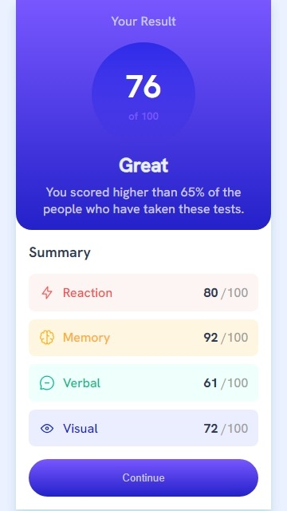

# Frontend Mentor - Results summary component solution

This is a solution to the [Results summary component challenge on Frontend Mentor](https://www.frontendmentor.io/challenges/results-summary-component-CE_K6s0maV). Frontend Mentor challenges help you improve your coding skills by building realistic projects. 

## Table of contents

- [Overview](#overview)
  - [The challenge](#the-challenge)
  - [Screenshot](#screenshot)
  - [Links](#links)
- [My process](#my-process)
  - [Built with](#built-with)
  - [What I learned](#what-i-learned)
  - [Continued development](#continued-development)
  - [Useful resources](#useful-resources)
- [Author](#author)
- [Acknowledgments](#acknowledgments)

**Note: Delete this note and update the table of contents based on what sections you keep.**

## Overview

### The challenge

Users should be able to:

- View the optimal layout for the interface depending on their device's screen size
- See hover and focus states for all interactive elements on the page
- **Bonus**: Use the local JSON data to dynamically populate the content

### Screenshot





### Links

- Solution URL: [Add solution URL here](https://your-solution-url.com)
- Live Site URL: [Add live site URL here](https://your-live-site-url.com)

## My process

### Built with

- Semantic HTML5 markup
- CSS custom properties
- Flexbox
- Mobile-first workflow

### What I learned

I am very excited about the dynamic content I was able to add using `Js`.
I have learnt alot about `DOM` content manipulation offered by `Js`

To see how the code snippets, see below:

```js
document.addEventListener('DOMContentLoaded',async()=>{
    let category = document.getElementById("text");
    try{
        let response = await fetch("../../data.json");
        let data = await response.json();
        data.forEach(element => {
            category.innerHTML += `
            <div class="record ${element.category}">
                <figure>
                    
                    <span>${element.category}</span>
                </figure>
                <p class="marks">${element.score} <span class="text-gray">/100</span></p>
            </div>
            `;
        });
    }catch(error){
        console.log(error);
    }

});
```

### Continued development
I want to dive into dynamic content development with `reactJs`


## Author

- Website - [Add your name here](https://www.your-site.com)
- Frontend Mentor - [@DR-KSP-VIRUS](https://www.frontendmentor.io/profile/DR-KSP-VIRUS)